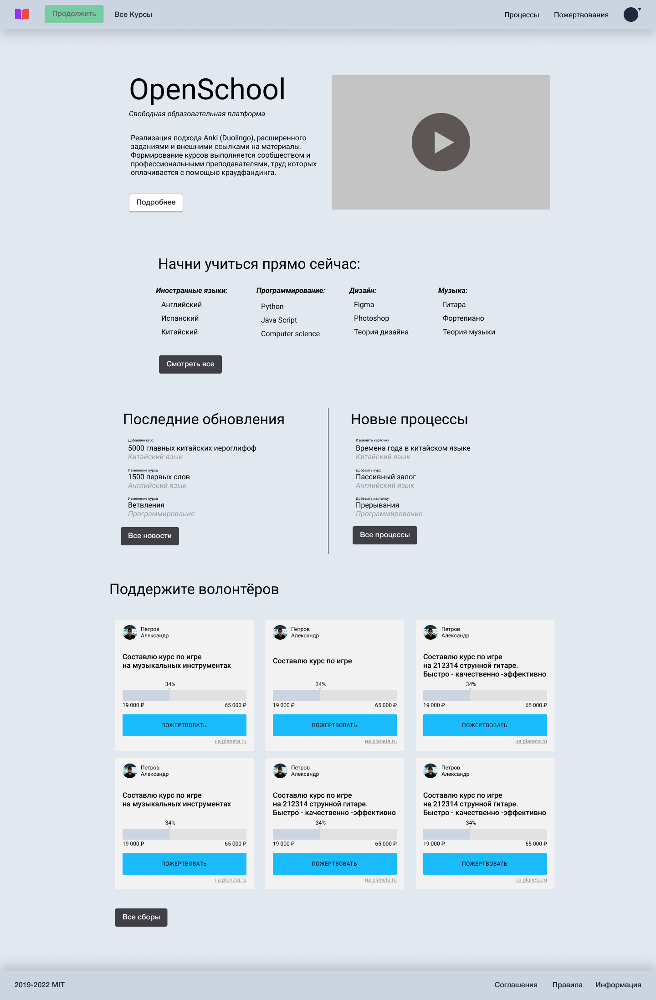
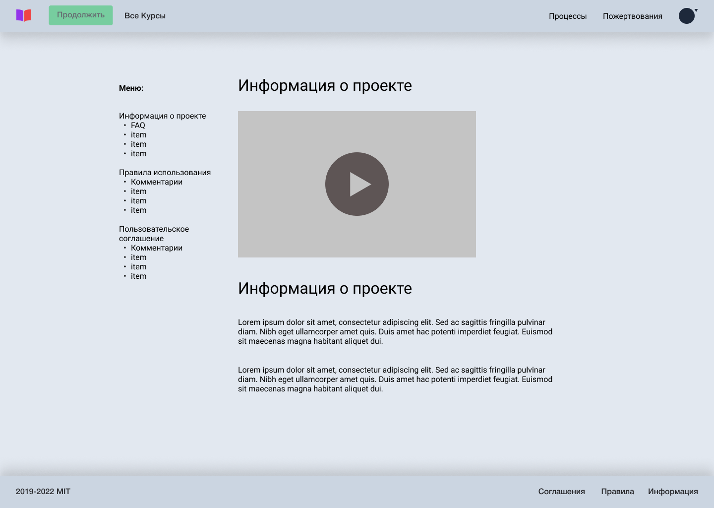
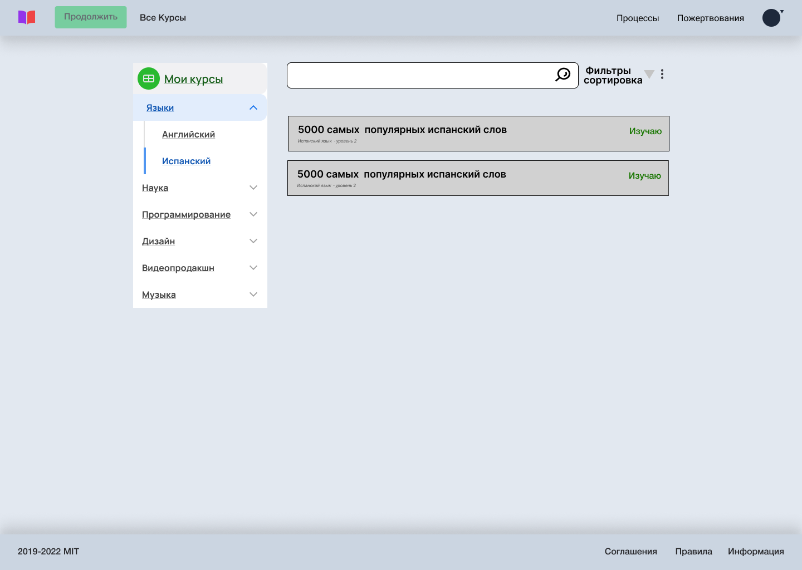
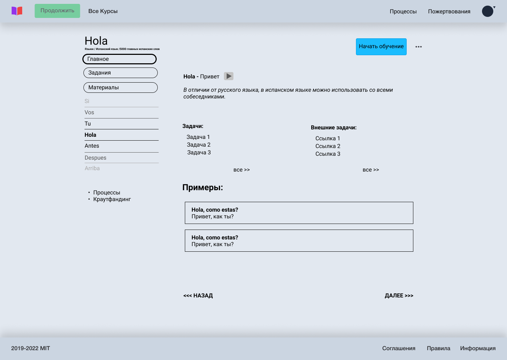

# OpenSchool - описание версии 1.0

**Основная информация**

На платформе участники сообщества могут изучать курсы на разнообразные темы, а также учавствовать в их создании и доработке. Курсы не являются авторскими и работа строится по приципу Википедии, те любой может предложить правку. Каждый курс разделён на микротемы, которые используются как карточки для заучивания (по типу Anki или Duolingo), кроме того, курсы можно последовательно изучать как учебник. По каждой теме собраны внешние ссылки и задания.

**Главная страница**

Первый блок - краткая информация о платформе и промо видео. "Подробнее" - переводит на страницу "О проекте". Ниже - разделы сайта и самые популярные подразделы .Ниже - Последние принятые сообществом решения и новые процессы. Ниже - текущие сборы участников для реализации проектов в рамках платформы.

**О проекте**

На данной странице размещены все правила, соглашения, ответы на частые вопросы итд. С левой стороны находится внутренняя навигация.

**Каталог - Список**

С левой стороны меню. Первый пункт - все курсы на которые подписан пользователь, остальные - разделы, нажав на которые можно выбрать подраздел. С правой стороны сверху фильты и сортировка, а так же поиск внутри раздела (подраздела). За тремя точками - процессы связанные с этой страницей, например, предложить новый курс, а также ссылки на процессы связанные с разделом. Карточки курсов имеют заголовок, дескрипшн и опционально пометку "изучаю", если курс активный у пользователя.

**Каталог - Курс**

Сверху название курса, чуть ниже путь до него в каталоге. Ещё чуть ниже общая статистика по курсу. Справа три точки с доп. ссылками, Ниже, тумблер, который активирует курс, а также личная статистика пользователя по данному курсу. С левой стороны меню со ссылками, которые относятся к данному курсу. Справа несколько случайных карточек с вопросом и ответом и ссылка на полный список. Ниже основные редакторы курса с ссылками на их профили. Далее несколько основных внешних ссылок по теме, ниже сборы средств, если они есть, связанные с курсом. 

**Каталог - Карточка - Главное**

Сверху пишется вопрос карточки, в данном случае слово Hola. Под ним путь до карточки в каталоге. Справа, кнопка "начать обучение", которая переносит на страницу авторизации, в случае если пользователь не авторизован. Если авторизован - кнопка меняется на "подписан на курс". За тремя точками - редактировать карточку. Возможно имеет смысл ссылки на формы старта процессов связанных со страницей выводить в виде иконок, тк их точно не будет больше трёх. 

